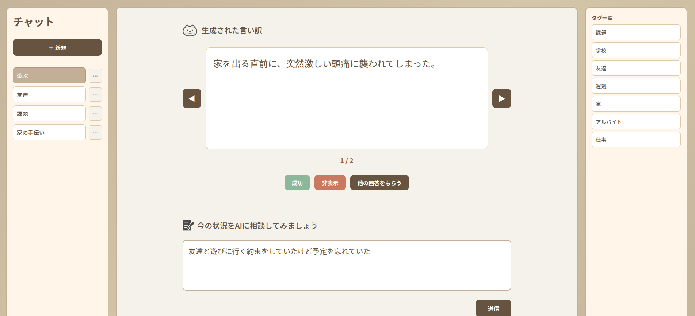

# 👋 自己紹介

### 名前・生年月日

森田　葵 (もりた　あおい) 
2000 年 8 月 26 日

### 学校

🏫 IT カレッジ沖縄　 IT スペシャリスト科　情報工学コース : 在籍 
(2027 年卒業予定)

### 趣味
* バイクに乗ること🏍 
* ゲームをすること🎮 

# ✍ 資格
* SEA/J Certified Security Basic Master
* CompTIA IT Fundamentals(ITF+)
* インターネット検定 ドットコムマスター ベーシック
* Linux技術者認定資格 LinuCレベル1 101試験
* サーティファイ Javaプログラミング能力認定試験 3級
* サーティファイ コミュニケーション検定 初級

### 今後取りたい資格
* Linux技術者認定資格 LinuCレベル1 102試験
* 基本情報技術者試験

# 🌱 技術スタック

> 高校は普通科を卒業。専門学校入学後は未経験からITの知識やプログラミングを学び、現在はWebアプリケーション開発の勉強をしております。
最近では学内のイベントに参加する学生に楽しんでもらえるようなWebアプリケーション開発をチームで取り組みました。

| カテゴリ              | 使用技術                             |
| --------------------- | ------------------------------------ |
| 💻 言語               | Java, Python, JavaScript, TypeScript             |
| 🎨 フロントエンド・フレームワーク    |  HTML, CSS, Next.js, Bootstrap        |
| ⚙️ バックエンド ・フレームワーク      | Node.js, Express                              |
|BaaSプラットフォーム    | Supabase, Firebase                              |
|データベース           | MariaDB                               |
| 🧰 エディタ・ツール等 |  VSCode, IntelliJ IDEA, Slack, GitHub |

### 今後触ってみたい言語や技術
* PHP

# 💻 制作物

スタンプラリー

><strong>制作日：</strong>2年生の10月頃の授業外で制作。学園祭で利用してもらうために制作しました。
>
><strong>制作人数：</strong>チーム制作（6人）
>
><strong>概要：</strong>学校イベントで学生の出席確認を目的に、楽しめるスタンプラリーアプリをチームで制作しました。
受付のQRコードからGoogleログインを行い、データベース登録名で出席を確認。各階のパスワードを使った6問の問題に挑戦し、全問正解者には景品を配布。さらにシークレット問題も用意し、追加景品を提供しました。
>
>
><strong>イメージ：</strong> 
>
><strong>技術スタック：</strong> 
>* 言語: JavaScript, TypeScript, CSS
>* フレームワーク: Next.js 15, Bootstrap 5
>* ライブラリ: NextAuth.js
>* データベース: Supabase
>* ORM: Prisma
>* デプロイ: Vercel
>
> <strong>リポジトリ：</strong> [stamp rally](https://github.com/itc-s24027/StampRally)

日記閲覧サイト

><strong>制作日：</strong>2年生の11月頃のNext.jsを学ぶ授業で制作しました。
>
><strong>制作人数：</strong>個人制作
>
><strong>概要：</strong>microCMSで日記を管理できる日記閲覧サイトです。タグごとの表示や、検索機能があります。
>
><strong>イメージ：</strong> 
>
><strong>技術スタック:</strong>
>* フレームワーク：Next.js (App Router)
>* 言語：TypeScript
>* スタイリング：CSS Module
>* データ管理：microCMS
>* デプロイ：Vercel
>* 画像生成：Gemini
>
> <strong>リポジトリ :</strong> [mydiary](https://github.com/itc-s24027/mydiary)

言い訳生成アプリ

> <strong>制作日：</strong>2年生の12月頃の進級制作で制作しました。
>
> <strong>制作人数：</strong>チーム制作（2人）
>
> <strong>概要：</strong>Gemini AIを取り入れた言い訳生成アプリです。ユーザーが入力した状況に合わせて適切な言い訳を生成してくれます。ランキング機能やタグ機能などたくさん機能を詰め込みました。
>
> <strong>イメージ：</strong> 
>
> <strong>技術スタック:</strong>
>* 言語：JavaScript / TypeScript / HTML / CSS
>* フレームワーク：Express / Next.js
>* データベース：Supabase（PostgreSQL）
>* ORM：Prisma
>* デプロイ：Vercel / Render
>* 認証：Firebase Authentication
>* AI：Google Gemini API
>
> <strong>リポジトリ :</strong> [excuse_maker_app](https://github.com/itc-s24027/excuse_maker_app)

# 💡 興味がある＆今後取り組みたいこと

- Web アプリ開発
- モバイルアプリ開発
- たくさんのフレームワークに触れたい

# 📞 連絡先

メールアドレス : [ s24027@itc.it-college.ac.jp ]
